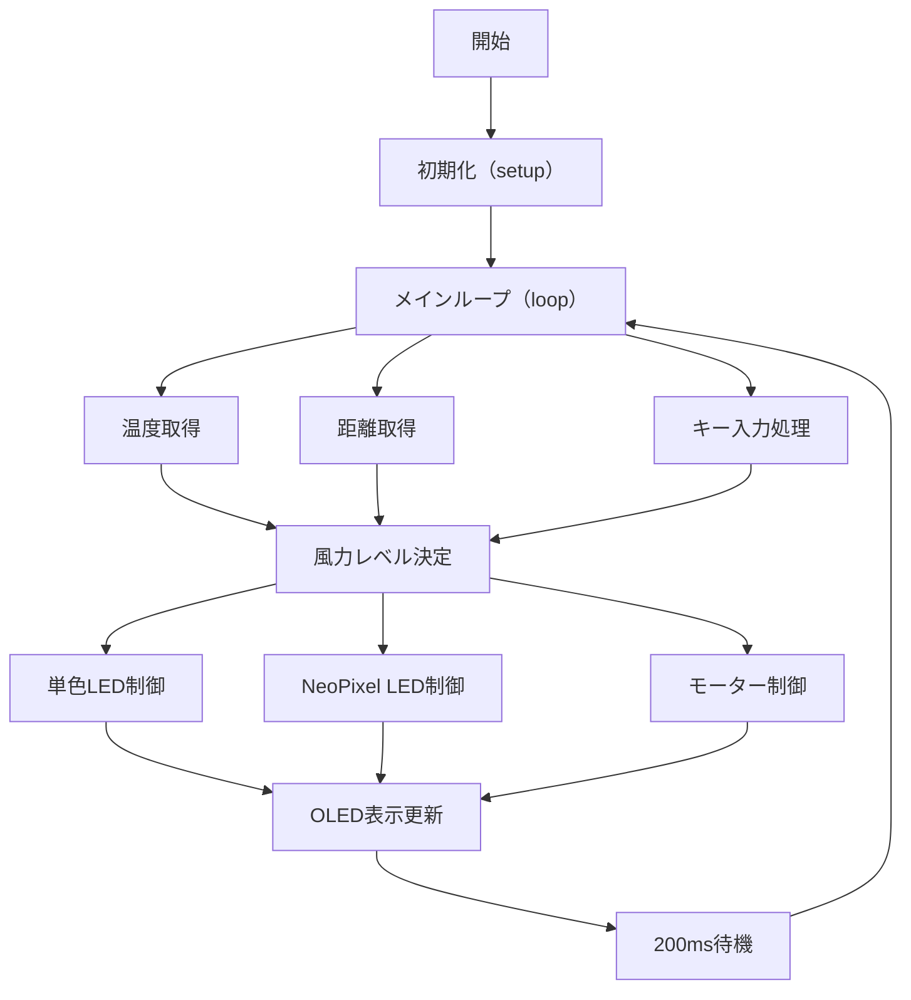

# 卒業制作2025

---

## 1. 概要

今回作ったのは温度と距離で自動的に風力を制御するもので、LED,OLEDディスプレイを使い、リアルタイムで見て状態が分かりやすく、さらにキーパットを入れることで手動にも変更可能となっている。

### 主な機能

・自動モード中温度に応じて風力レベルが0~8に変化する。 
・自動モード人が近づいたとき（20cm以内）の場合のみ送風される。 
・キーパッドでの自動モード、手動モードの切り替えが可能 
・OLED画面に温度、距離、風力、モードが表示される。 
・WS2812 RGB LEDストリップによる風力レベルの表示 
・単色LEDで温度と距離が条件内か条件外かがわかる。 

## 2. 仕様書

### 配線図と回路図 （※超音波モジュールをTRRS1ジャック、LEDストリップをWS2812b、 TA6586モータードライバーICをNE555、キーパッドをBUTTONPADで代用している）

- **配線図** 

- **回路図** 

### 使用部品とピン

|部品名|用途|接続ピン|
|----|---|--------|
|超音波センサー|距離測定|Trig : D3 Echo : D2|
|サーミスター+10kΩ|温度測定|VCC : 5V GND : A0 : GND|
|DCモーター+TA6586 - モータードライバーIC|モーター制御|IN : D7 IN : D6 VCC : 5V GND : GND|
|単色LED（赤）+330Ω|条件表示 |VCC : D5 GND : GND|
|WS2812 RGB LEDストリップ（NeoPixel）|風力表示 | DO : D4  VCC : 5V  GND : GND |
|OLEDディスプレイモジュール|情報表示|SDA : SDA SCK : SCL VDD : 5V GND : GND|
|4x4キーパッド|入力操作|行 : D8–D11   列 : A1–A3, D12|
|Arduino UNO R4 wifi|制御＋通信|USBケーブル|

## 3. 動作仕様書

### フローチャート

### 自動モード

- 温度が**20℃以下**の時、風力はLv.0（停止）
- 温度が**20℃より大きい～36℃**の時、風力はLv.1～Lv8に自動設定（約2℃上がることLv.1上がる）
- **距離が20cm以内かつ20℃より大きい**場合のみモーターが動き出す。
- NeoPixel LED が風力に応じて色変化

### 手動モード

- キーパッドの**Aキー**で自動モード、手動モード切り替え
- **0~8キー**を押して任意の風力レベルを設定可能
- 自動モードでの**温度**、**距離**の条件を無視して動作可能

## LED 表示仕様

### WS2812 RGB LEDストリップのカラー表

|風力|色   |風力|
|---|-----|----|
|0  |消灯  |なし|
|1  |青   |弱|
|2~4|青～緑|弱から中|
|5  |緑|中|
|6~7|緑～赤|中から強|
|8  |赤|最大|

### 単色LED動作

|条件|明るさ|
|---|----|
|温度が20℃かつ距離が20㎝以下|最大|
|どちらかを満たす場合|中|
|両方満たさない|消灯|

### 5. OLED表示内容（例）

|表してる物|表示|
|---------|-----|
|温度|25.0 C|
|距離|10cm|
|風力|4|
|モード|Auto|

## 6.プログラムの構成

### 使用ライブラリ

- Adafruit_GFX (https://github.com/adafruit/Adafruit-GFX-Library) 
- Adafruit_SSD1306 (https://github.com/adafruit/Adafruit_SSD1306) 
- Adafruit_NeoPixel (https://github.com/adafruit/Adafruit_NeoPixel) 
- Adafruit_Keypad (https://github.com/adafruit/Adafruit_Keypad) 
- Wire.h (https://github.com/arduino/ArduinoCore-avr/tree/master/libraries/Wire) 

### ループ処理の流れ（loop）

1. キーパッド入力の確認と処理  
2. 温度・距離をセンサから取得  
3. モードに応じて風力レベルを決定  
4. モーターPWM出力制御  
5. NeoPixel LED更新  
6. 単色LED更新  
7. OLEDディスプレイ更新  
8. 200msごとに繰り返し

## 8. 工夫・応用可能性

### 工夫点

- 距離センサーによる省エネ効果で20㎝以内にいる場合のみモーターを稼働させることで、不必要な動作を抑え、無駄な電力消費を減らした
- OLEDディスプレイに温度・距離・風力・モードをリアルタイム表示したり、LEDの明るさを変化させることで状態を理解しやすいようにした
- 手動操作との切り替え対応を入れたことで例外なときでも対応しやすいように柔軟に変化可能
- 風力レベルの段階設定を2℃刻みに調整することで急激な風力の変化を防いでいる。

### QRコード

- **動作の様子とコード入り** 
 
 QRコードのURL (https://nkn-469.github.io/my-videoandcode-page/) 
 動作のGit Hub (https://github.com/Nkn-469/my-videoandcode-page) 

### 作るときに参考にしたサイト一覧

- 基本プロジェクトサーミスタ(https://docs.sunfounder.com/projects/elite-explorer-kit/ja/latest/basic_projects/02_basic_thermistor.html) (https://docs.sunfounder.com/projects/elite-explorer-kit/ja/latest/basic_projects/02_basic_thermistor.html) 

- 基本プロジェクト超音波 (https://docs.sunfounder.com/projects/elite-explorer-kit/ja/latest/basic_projects/06_basic_ultrasonic_sensor.html) 

- 基本プロジェクトLEDモジュール (https://docs.sunfounder.com/projects/elite-explorer-kit/ja/latest/basic_projects/10_basic_led.html) 

- 基本プロジェクトWS2812 RGB LEDストリップ (https://docs.sunfounder.com/projects/elite-explorer-kit/ja/latest/basic_projects/12_basic_ws2812.html) 

- 基本プロジェクトOLED (https://docs.sunfounder.com/projects/elite-explorer-kit/ja/latest/basic_projects/15_basic_oled.html) 

- 基本プロジェクトキーパッド (https://docs.sunfounder.com/projects/elite-explorer-kit/ja/latest/basic_projects/21_basic_keypad.html) 

- 基本プロジェクトモーター (https://docs.sunfounder.com/projects/elite-explorer-kit/ja/latest/basic_projects/24_basic_motor.html) 

- 楽しいプロジェクト光敏アレイ (https://docs.sunfounder.com/projects/elite-explorer-kit/ja/latest/fun_projects/04_fun_light_array.html) 

- 楽しいプロジェクトスマートファン (https://docs.sunfounder.com/projects/elite-explorer-kit/ja/latest/fun_projects/06_fun_smart_fan.html) 

- Project Hub (https://projecthub.arduino.cc/ambhatt/temperature-controlled-fan-with-lcd-using-arduino-ac0231) 

